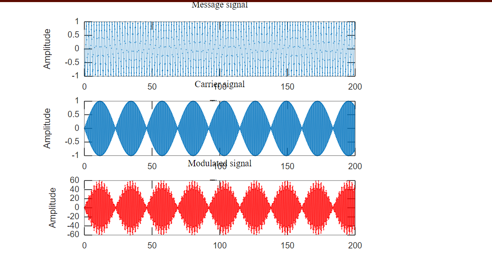
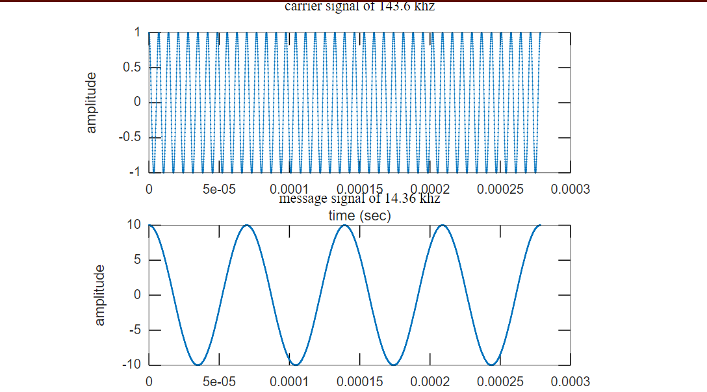
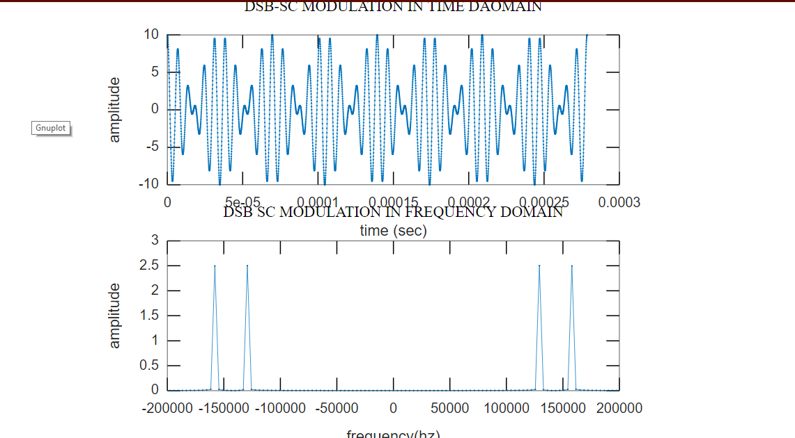
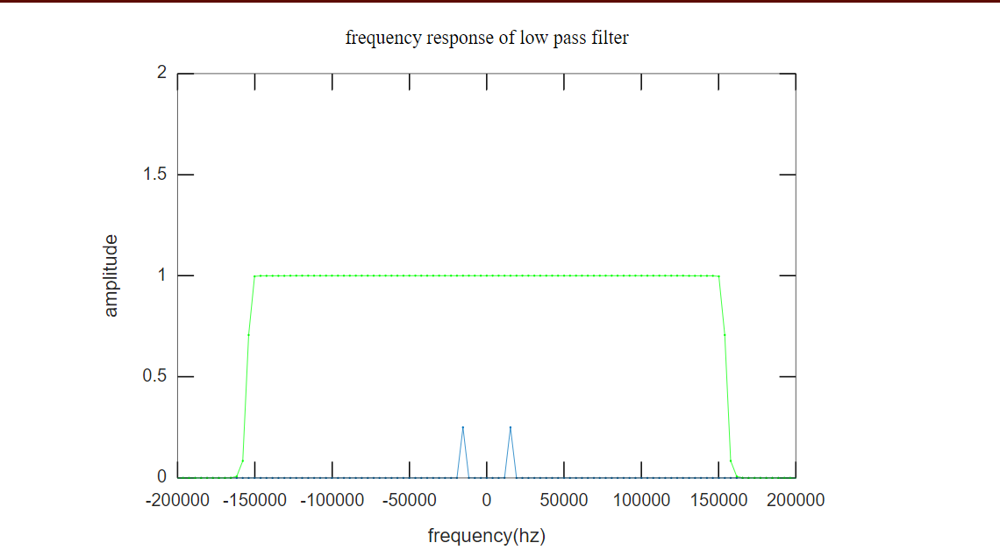
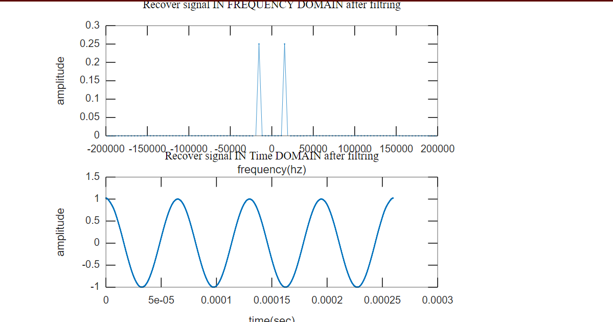
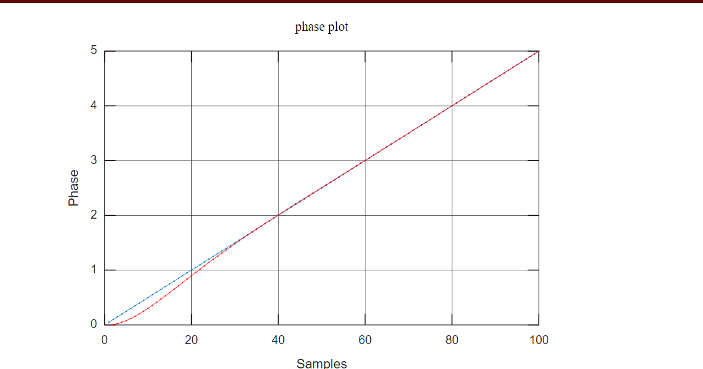
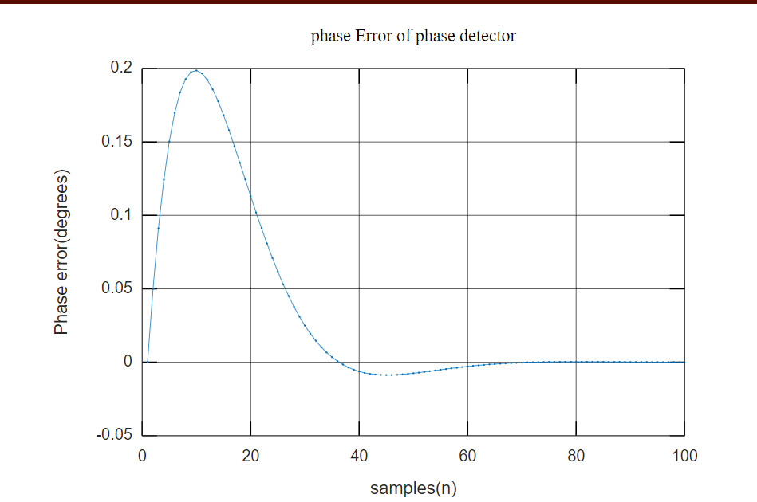
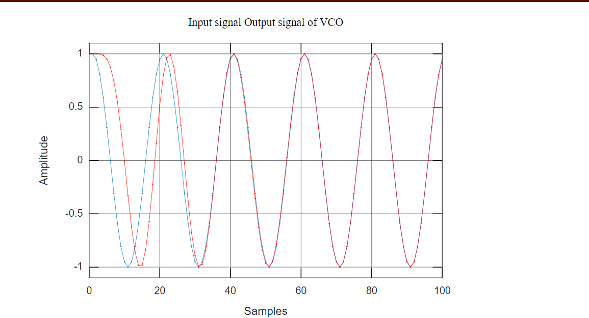
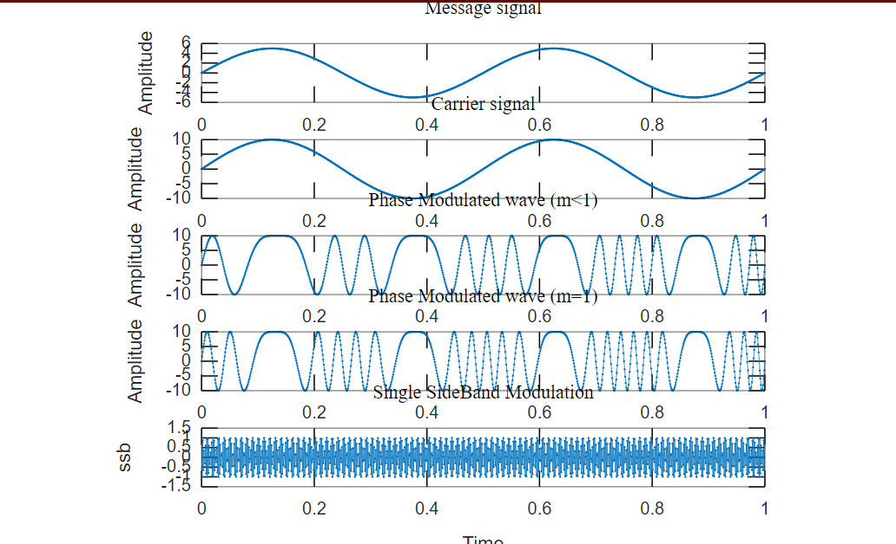

# CommunicationSystem-I
Matlab programs in Communication Lab
If you don't have Matlab Install or Just Can't offord to buy Matlab.Then you can run all these program in the Light Weigth Browser Editer 
### [Octave Online](https://octave-online.net/)
# 1. Amplitude Modulation
After inserting sutiable and relatiable values we can obtain plot like this

# 2. Double SideBand Supressed Carrier
We can visualise DSB-SC like 

# 3. Double SideBand Supressed Carrier Demodulation

# 4. Phase Locked Loop FM Demodulator

# 5. SSB-SC Modulation

